# Lab1

## [SwinTransformer](https://arxiv.org/abs/2103.14030)

Одной из первых предложенных архитектур использовавшей механизм внимания в задачах Computer Vision был [ViT](https://arxiv.org/abs/2010.11929). Его основной проблемой была квадратичная вычислительная сложность и большой размер патчей, который делал его применение в задачах детекции и сегментации затруднительным. SwinTranformer учитывал данные проблемы и предлагался как хороший backbone для детекции и сегментации.

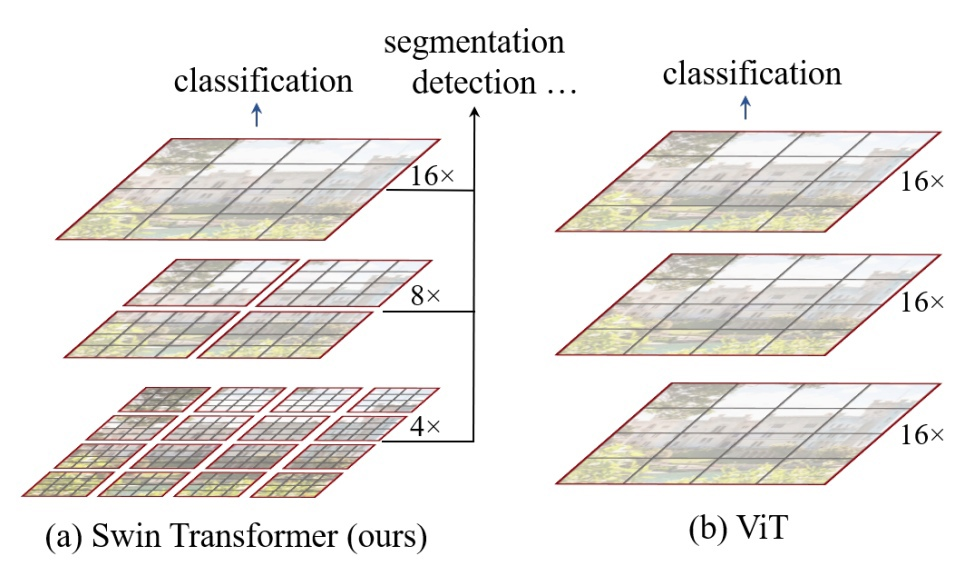

### Архитектура
В общем виде архитектура выглядит так:
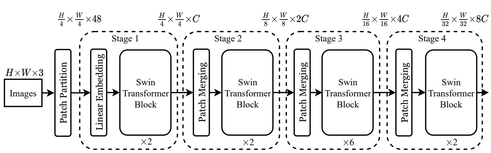

Изначально изображение нарезается на непересекающиеся патчи, также как и в ViT, но в данном случае размеры патча уже не 16х16, а 4х4, что позволяет улавливать более мелкие детали на изображении. Разбиением занимается блок *Patch Partition*, после чего $\frac{H}{4}\times\frac{W}{4}$ патчей размерностью $4\times4\times3=48$ с помощью *Linear Embedding* слоя переходят во внутреннюю размерность, обозначенную *C*

*С* зависит от реализации. Авторы предложили 4 варианта архитектуры с различной размерностью *C* и различным количеством Swin Transformer Block на каждой стадии. Параметры архитектур подбирались для дальнейшего сопоставления с CNN аналогами. Параметры для Swin-B подбирались, чтобы иметь размер модели и сложность вычислений, аналогичные ViTB/DeiT-B. Сложность Swin-T и Swin-S аналогична сложности ResNet-50 (DeiT-S) и ResNet-101, соответственно.

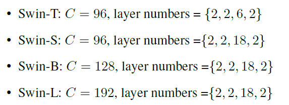

Swin Transformer Block

Представляет из себя два последовательнных трансформер блока с MLP (Multilayer Perceptron)

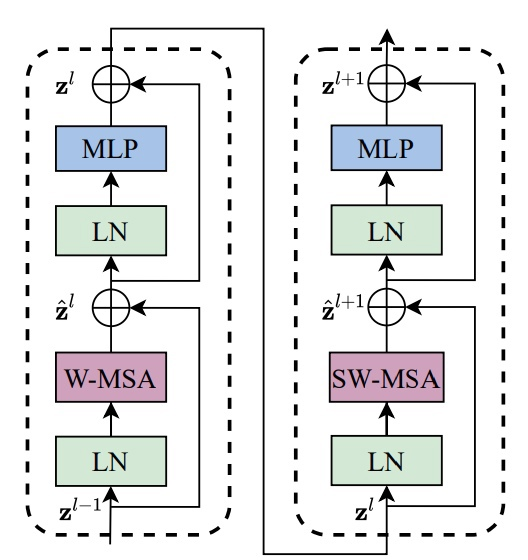

Важным отличием от ViT тут является **W**-MSA и **SW**-MSA.

Как уже говорилось MSA (multi-head self attention) имеет проблему квадратичной вычислительной сложности. W-MSA (Window multi-head self attention) предлагает считать внимание внутри локальных окон, включающих $M\times M$ патчей. В статье $M=7$.  Вычисения MSA и W-MSA

$Ω(MSA) = 4hwC^2 + 2(hw)^2C$

$Ω(W-MSA) = 4hwC^2 + 2M^2hwC$

Данное решение значнительно уменьшило вычисления и позволило использовать внимание на изображениях высокого разрешения, но за счёт непересекающихся окон терялась связь между ними.

Для этого было предложено SW-MSA (Shifted Window multi-head self attention)

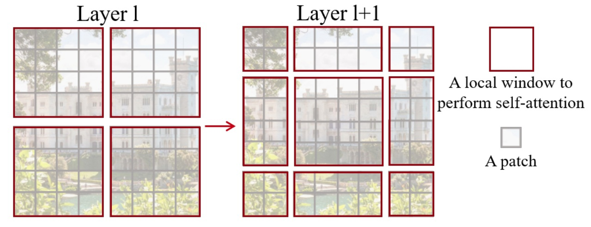

Окна внимания сдвигаются по диагонали на $[\frac{M}{2},\frac{M}{2}]$. А так как окна самовнимания фиксированного размера, после сдвига не все окна выходят заполненными. Заполнение неполных областей нулями сильно увеличило бы время вычислений и не придало особой точности, поэтому авторами был предложен циклический сдвиг, который возвращал количество окон к их несдвинотому количеству. А чтобы избежать вычисления внимания несмежных облостей, полученных после циклического сдвига, применялось маскирование самовнимания.

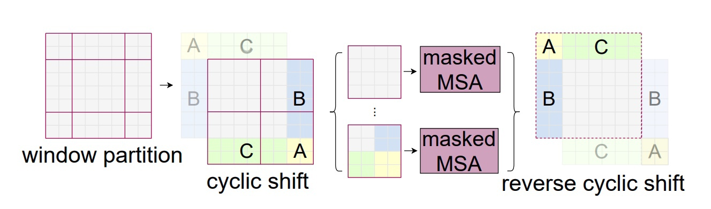

Patch Merging

Patch Merging блоки призваны понижать размер карт в два раза на каждой стадии обработки изображения, перед подачей их в Swin Tranformer Block.
 Patch Meging умненьшают разрешение в два раза за счёт объединения 2x2 соседних патчей в один глубиной 4C и с помощью линейного слоя глубина уменьшается до 2C 

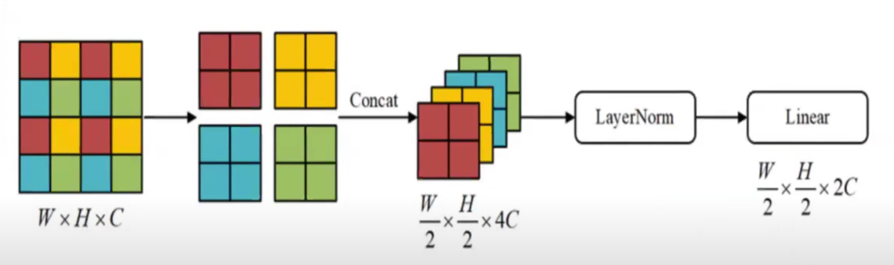

Patch Merging + Swin Transformer Block
 Представляют из себя одну стадию обработки изображения, в целом напоминающую CNN архиетктуры (уменьшается разрешение, увеличивается количество каналов). Полученные с разных стадий результаты могут использоваться для детекции и сегментации мельких объектов.

Также в SwinTranformer применялся другой подход позиционирования патчей — относительное позиционирование, и по результатам, он работает лушче, чем абсолютное позиционирование.

$Attention(Q, K, V ) = SoftMax(QK^T/\sqrt{d} + B)V, B \in \mathbb{R}^{M^2 \times M^2}$

## Adam и RAdam
### [Adam](https://arxiv.org/abs/1412.6980)
Оптимизационный метод комбинирующий в себе идеи [Adagrad](https://jmlr.org/papers/v12/duchi11a.html) и [RMSprop](https://www.cs.toronto.edu/~tijmen/csc321/slides/lecture_slides_lec6.pdf). От первого наследуется инерционность с использованием предыдущих градиентов, от втого наследуется адаптивная скорость обучения для каждого параметра.

### [RAdam](https://arxiv.org/abs/1908.03265)

Rectified Adam во многом вдохновляется идей warmup приема и старается исправить проблему высокой дисперсии на ранних стадиях оптимизации. 

Rectification Term - новшество, которое используется при обновлении параметров.

$$r_t = \sqrt{\frac{(\rho_t-4)(\rho_t-2)\rho_\infty}
{(\rho_\infty-4)(\rho_\infty-2)\rho_t}}$$

$\theta_t = \theta_{t-1} − \alpha_t r_t \widehat{m_t} l_t$, где $\alpha_t$ - step size, $\widehat{m_t}$ - bias-corrected moving average, $l_t$ - adaptive learning rate

Стоит отметить, что если $\beta_2 ≤ 0.6$, то $\rho_\infty ≤ 4$ и RAdam вырождается в SGD с импульсом

Adam with warmup близок с RAdam по точности, однако Adam with warmup более чувствителен к начальной скорости обучения, а также требует подбора.длительности(количество шагов) разминки.
## Тестирование

Производились запуски с оптимизаторами Adam и RAdam

Первое тестирование проводилось на датасете [Stanford Cars Dataset](https://www.kaggle.com/datasets/jessicali9530/stanford-cars-dataset). Предполагается классификация 196 марок машин по их изображению. 

К сожалению, за 30 эпох модель обучилась с точностью 0.09

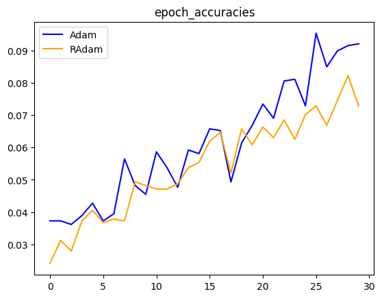
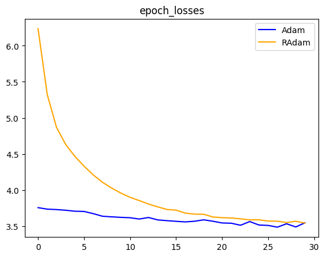

Второе тестирование проводилось на датасете [DVM-Car](https://deepvisualmarketing.github.io/). Предполагалось классифицировать цвет машины по её изображению. Было оставлено 11 наиболее популярных цветов.

За те же 30 эпох модель показала результат в 0.8 точности и 0.8 f1_macro

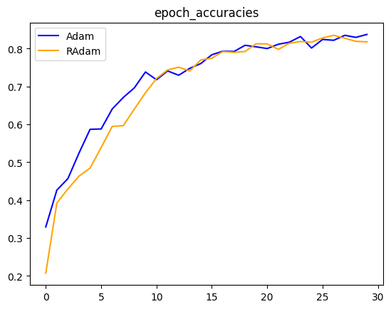
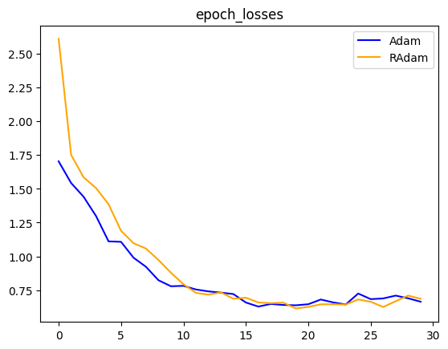
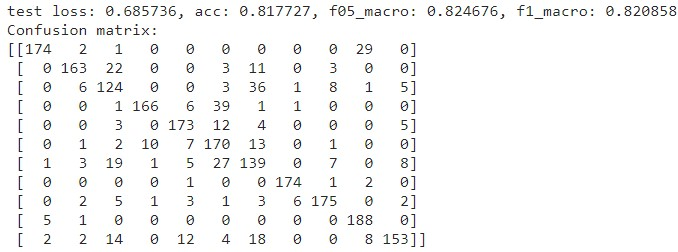

В обоих случаях RAdam повел себя обратно ожиданиям. В теории RAdam должен был показать меньший loss на первых эпохах, чем Adam.

## Выводы по работе
SwinsTranformer более удачная архитектура, чем ViT, так как позволяет анализировать изображение более детально и учитывать мелкие объекты, что позволяет применять её в задачах детекции и сегментации.

Её реализация частисно схожа с ViT, но меняет подход уменьшения размерности, уменьшает вычислительную сложность, при этом оставляя связи между непересекающимися окнами и использует несколько другой подход позиционирования.

В ходе лабораторной мы не смогли оценить SwinTransformer в задачах для которых его создавали (детекция, сегментация), но в задаче классификации он показал себя как хорошая замена bacbone основанному на свёртках.

## Использованные источники
* [Swin Transformer: Hierarchical Vision Transformer using Shifted Windows](https://arxiv.org/abs/2103.14030)
* [An Image is Worth 16x16 Words: Transformers for Image Recognition at Scale](https://arxiv.org/abs/2010.11929)
* [Official implementation for "Swin Transformer: Hierarchical Vision Transformer using Shifted Windows"](https://github.com/microsoft/Swin-Transformer/blob/main/models/swin_transformer.py)
* [Adam: A Method for Stochastic Optimization](https://arxiv.org/abs/1412.6980)
* [On the Variance of the Adaptive Learning Rate and Beyond](https://arxiv.org/abs/1908.03265)
* [Adaptive Subgradient Methods for Online Learning and Stochastic Optimization](https://jmlr.org/papers/v12/duchi11a.html)
* [Tieleman, T. and Hinton, G. Lecture 6.5 - RMSProp, COURSERA: Neural Networks for Machine Learning.
Technical report, 2012](https://www.cs.toronto.edu/~tijmen/csc321/slides/lecture_slides_lec6.pdf)
