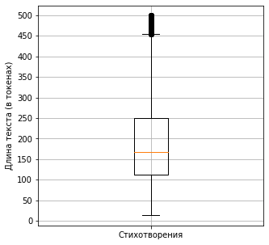
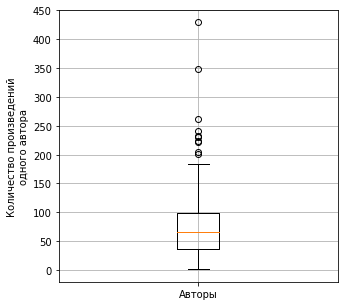
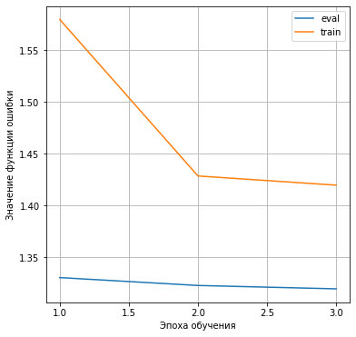

# Отчёт "Лабораторная №3"

**Работу выполнили студенты 1 курса магистратуры (группа M4130) ИТМО:** Меньщиков Михаил, Лютиков Богдан, Рогачёв Кирилл

**Дисциплина:** Технологии программирования и обучения глубоких сетей

**ИТМО 2023**

# **Содержание:**

[1 Постановка задания (ответственный: Михаил)](#1-постановка-задания-ответственный-михаил)

[2 Решение (ответственный: Михаил)](#2-решение-ответственный-михаил)

[2.1 Описание](#21-описание)

[2.2 Структура кода](#22-структура-кода)

[2.3 Выводы](#23-выводы)

[3 Заключение (ответственный: Михаил)](#3-заключение-ответственный-михаил)

[Список использованных источников](#список-использованных-источников)

[Приложение А (ответственный: Кирилл)](#приложение-а)

[Список использованных источников](#список-использованных-источников-1)

[Приложение Б (ответственный: Кирилл)](#приложение-б)

[Список использованных источников](#список-использованных-источников-2)

##

## **1 Постановка задания** (ответственный: Михаил)

**Цель:** Познакомиться с задачей генерации текста.

**Задание:**

1. Скачать датасет enwiki8, поэтический корпус русского языка или Шекспира, Пушкина.
2. Реализовать нейронную сеть, указанную в варианте для задачи Text Generation.
3. Оценить качество модели на chrF(++).
4. Сделать отчёт и выложить исходный код на GitHub.

**Выбранный вариант:** 14 (Pretrained LLM + IA3)

## **2 Решение** (ответственный: Михаил)

## **2.1 Описание**

В качестве тренировочного датасета был использован "Поэтический корпус русского языка" [1]. Датасет представляет из себя множество стихотворных произведений русскоязычных авторов, каждый из которых содержит: текст стихотворения, его название, год написания и автора. Объём корпуса составляет 16694 литературных произведения.

Так как в корпусе присутствовали стихотворения-выбросы длинной более 600 токенов, которые могли бы негативным образом повлиять на процесс обучения и итоговое качество, было принято решение их не использовать. Также для обучения не использовались те произведения, у которых в корпусе были пустыми поле названия или поле автора. Таким образом, используемое множество составило 14846 литературных произведений. На Рисунке 1 представлено распределение длин оставшихся стихотворений. На рисунке 2 представлено распределение количества стихотворений, приходящегося на каждого автора в оставшемся множестве.

**Рисунок 1.** Распределение длин стихотворений (в токенах) в отфильтрованном корпусе

На основании Рисунка 1 максимальная, средняя и минимальная длина текста составляет 499, 190 и 13 соответственно.

**Рисунок 2.** Распределение количества стихотворений на одного автора в отфильтрованном корпусе

На основании Рисунка 2 максимальное, средняя и минимальная количество стихотворений на автора составляет 429, 76 и 1 соответственно. Всего в датасете присутствуют стихотворения от 193 авторов. Пятёрка часто-встречаемых авторов: Владимир Высоцкий – 429; Александр Пушкин – 348; Анна Ахматова – 262; Александр Блок – 240; Илья Эренбург – 233. Пятёрка редко-встречаемых авторов: Евгений Гребенка – 2; Владислав Крапивин – 2; Алексей Ржевский – 2; Александр Грибоедов – 1; Апполон Григорьев – 1.

В качестве архитектуры нейронной сети для задачи генерации текста используется класс AutoModelForCausalLM [2] из библиотеки transformers [3]. В качестве предобученной языковой модели используется ruGPT3.5 (от SberDevices) [4]. Так как данная модель занимает ~50 GB было принято решение использовать её 8-ми битную версию (занимает ~13 GB) для дообучения. Был применён IA3-алгоритм [5] дообучения из библиотеки Peft [6], который замораживает веса базовой модели, добавляет дополнительные слои-адаптеры и выполняет обновление только их весов во время обучения. Данный алгоритма позволяет сократить временные и вычислительные ресурсы, которые потребуются для дообучения больших языковых моделей.

Для генерации стихотворений используется следующий начальный промпт: _"###Система:\nТы - поэт, который чётко следует инструкциям. Твоя задача - написать одно стихотворение в стиле указанного автора по заданному названию. Будь внимателен и не пиши ничего лишнего. Напиши только сам стих без указания дополниетльной информации к нему.\n\n\n\n###Автор:\nAUTHOR\n\n###Название:\nTITLE\n\n###Стихотворение:\n"_, где AUTHOR - имя автора, в стиле которого должно быть сгенерировано стихотоворение, а TITLE - название генерируемого стихотворения.

Исходная выборка была разбита на train/test-части в соотношении 85/15. В качестве аппаратного обеспечения была арендована видеокарта RTX3090 (24 GB видео-памяти) [7]. Для процесса обучения были заданы следующие значения гиперпараметров: epochs – 3; optimizer – Adam; scheduler – linear with warmup; num\_warmup\_steps – 2; learning\_rate – 2e-4; train\_batch\_size – 1; num\_accumulation\_steps – 16; eval\_batch\_size – 1. В среднем каждая эпоха обучения + валидация заняла ~5.5 часов. На Рисунке 3 представлено изменение функции ошибки на train- и eval-выборках в процессе обучения модели.

**Рисунок 3.** Изменение функций ошибки в процессе обучения TextGeneration-модели

Далее был выполнен перебор гиперпарметров генерации текста с помощью библиотеки Optuna [8]. После нескольких попыток перебора гиперпараметров для BeamSearch-алгоритма [9] было принято решение от него отказаться, так как генерация с его помощью занимает ~10 минут на арендованной видеокарте, а также наблюдалось низкое качество генерации: генерировалось достаточное количество несвязных подпоследовательностей символов. Таким образом, перебрались гиперпараметры только для Sampling-алгоритма [10]: top\_k, top\_p, repetition\_penalty, temperature, no\_repeat\_ngram\_size. Из-за долгого процесса генерации и ограниченных вычислительных ресурсов было протестировано 15 конфигураций: 10 примеров для оценки качества на конфигурацию. В качестве оптимизируемой (на максимум) метрики использовалась chrf(++) [11]. Процесс генерации был ограничен 400 токенами. В результате была получена лучшая конфигурация со значением chatf-метрики 43.6: top\_k – 10; top\_p – 0.95; repetition\_penalty – 0.9; temperature – 14.4; no\_repeat\_ngram\_size – 0.

## **2.2 Структура кода**

- /data – датасеты, используемые для дообучения модели
- /debug
  - dataset\_prepare.ipynb – подготовки обучающего/тестового множеств.
  - generate\_example.ipynb – пример конвейера для генерации стихов с помощью полученной модели.
- /metrics – директория с метриками и лог-файлами, полученных в процессе обучения используемых моделей.
- generate\_search.py – перебор гиперпараметров генерации текста с помощью Optuna-библиотеки.
- load\_full\_rugpt35.py – загрзку ruGPT3.5-модели на локальную машину.
- poengen\_train.py – дообучение 8-ми битной модели с помощью IA3-алгоритма.
- test\_load\_gpt35\_8bit.py – тестирование запуска 8-ми битной ruGPT3.5-модели.

## **2.3 Выводы**

Таким образом, была обучена TextGeneration-модель для задачи генерации стихотворений. Для прлученнлй модели значение метрики CharF(++) равно 0.43 при объёме тестовой выборки 15 текстов.

**Недостатки.** (1)полученная модель недостаточно обучена для генерации человеко-читаемых и согласованных с правилами русского языка стихотворений. Возможно, был выбран слишком сложный промпт для инициализации процесса генерации. (2) У модели на этапе генерации проблема с поиском завершающего токена. (3) Из-за объёма базовой модели процесс дообучения и генерации занимает продолжительное время.

**Возможные улучшения. (1)** Расширить тренировочное множество; выполнить перебор возможных промптов для генерации; протестировать другие алгоритмы дообучения больших языковых моделей из библиотеки Peft. (2) Задать большее количество попыток для поиска оптимальной стратегии генерации текста с помощью Optuna. (3) В качестве базовой протестировать другие более легковесные модели.

## **3 Заключение** (ответственный: Михаил)

В результате выполнения данной лабораторной был получен практический опыт дообучения нейросетевых моделей для задачи генерации текста. Была получена модель генерации стихотворений в стиле указанного автора по заданному названию. В качества базовой была использована ruGPT3.5-модель (от SberDevices), а также IA3-алгоритм из библиотеки peft для дообучения данной большой языковой модели.

## **Список использованных источников**

1. PoetryCorpus [Электронный ресурс] // github.com. – 2023. – URL: [https://github.com/IlyaGusev/PoetryCorpus](https://github.com/IlyaGusev/PoetryCorpus) (дата обращения: 28.12.23)
2. AutoModelForCausalLM [Электронный ресурс] // huggingface.co. – 2024. – URL: [https://huggingface.co/docs/transformers/main/model\_doc/auto#transformers.AutoModelForCausalLM](https://huggingface.co/docs/transformers/main/model_doc/auto#transformers.AutoModelForCausalLM) (дата обращения: 02.01.24)
3. Transformers. Documentation [Электронный ресурс] // huggingface.co. – 2024. – URL: [https://huggingface.co/docs/transformers/index](https://huggingface.co/docs/transformers/index) (дата обращения: 02.01.24)
4. ai-forever/ruGPT-3.5-13B [Электронный ресурс] // huggingface.co. – 2024. – URL: https://huggingface.co/ai-forever/ruGPT-3.5-13B (дата обращения: 02.01.24)
5. Few-Shot Parameter-Efficient Fine-Tuning is Better and Cheaper than In-Context Learning [Электронный ресурс] // arxiv.org. – 2024. – URL: [https://arxiv.org/abs/2205.05638](https://arxiv.org/abs/2205.05638) (дата обращения: 02.01.24)
6. Peft. Documentation [Электронный ресурс] // huggingface.co. – 2024. – URL: [https://huggingface.co/docs/peft/index](https://huggingface.co/docs/peft/index) (дата обращения: 02.01.24)
7. Immers Cloud [Электронный ресурс] // immers.cloud. – 2023. – URL: [https://immers.cloud/](https://immers.cloud/) (дата обращения: 28.12.23)
8. Optuna. Documentation [Электронный ресурс] // optuna.readthedocs.io. – 2024. – URL: [https://optuna.readthedocs.io/en/stable/](https://optuna.readthedocs.io/en/stable/) (дата обращения: 02.01.24)
9. BeamSearch generation strategie [Электронный ресурс] // immers.cloud. – 2024. – URL: [https://huggingface.co/blog/how-to-generate#beam-search](https://huggingface.co/blog/how-to-generate#beam-search) (дата обращения: 02.01.24)
10. Sampling generation strategie [Электронный ресурс] // huggingface.co. – 2024. – URL: [https://huggingface.co/blog/how-to-generate#sampling](https://huggingface.co/blog/how-to-generate#sampling) (дата обращения: 02.01.24)
11. CharF++ [Электронный ресурс] // huggingface.co. – 2024. – URL: [https://huggingface.co/spaces/evaluate-metric/chrf](https://huggingface.co/spaces/evaluate-metric/chrf) (дата обращения: 02.01.24)
12. URL: [https://habr.com/ru/articles/599673/](https://habr.com/ru/articles/599673/) (дата обращения 14.01.2024)

## **Приложение А**

**Описание GPT-архитектуры**

Архитектура GPT - это декодер из архитектуры T5-трансформера, работающий без дополнительной информации, поступающей от энкодера. На рисунке 1 ниже представлен последний слой с предшествующим ему блоком (Transformer Decoder Block). Обычно блоков используется несколько (например GPT-2 small - 12 блоков, GPT-2 Extra Large - 48 и GPT-3 - 96 [2]) и каждый из них передает свой результат следующему, формируя тем самым цепочку декодера. GPT специально обучают предсказывать следующий токен последовательности, посредством того, что подают на выход последовательность токенов, и ожидают на выходе все токены кроме первого в самом начале и с новым предсказанным токеном в конце. Так модель за один проход предсказывает один следующий токен, за счет чего итеративно может генерировать крупный текст.

**Рисунок 1.** Схема одноблочной GPT модели. [1]

Алгоритм работы модели [1]:

1. Входной текст токенизируется в последовательность чисел (токенов).
2. Список токенов проходит через Embedding Layer (линейный слой) и превращается в список эмбеддингов (очень похоже на word2vec).
3. К каждому эмбеддингу прибавляется positional embedding, кодирующий информацию о позиции слова в тексте.
4. Далее список эмбеддингов начинает своё путешествие через несколько одинаковых блоков (Transformer Decoder Block), о которых я тоже расскажу потом.
5. После того как список эмбеддингов пройдёт через последний блок, эмбеддинг, соответствующий последнему токену матрично умножается на всё тот же входной, но уже транспонированный Embedding Layer и после применения SoftMax получается распределение вероятностей следующего токена.
6. Из этого распределения выбираем следующий токен (например с помощью функции argmax).
7. Добавляем этот токен к входному тексту и повторяем шаги 1-6.

## **Список использованных источников**

1. GPT для чайников: от токенизации до файнтюнинга [Электронный ресурс] // habr.ru. – 2024. – URL: [https://habr.com/ru/articles/599673/](https://habr.com/ru/articles/599673/) (дата обращения: 14.01.24)
2. Neural networks made easy (Part 11): A take on GPT [Электронный ресурс] // mql5.com – 2024. – URL: [https://www.mql5.com/en/articles/9025#:~:text=And%20each%20block%20has%20its,while%20GPT-3%20has%2096%20blocks](https://www.mql5.com/en/articles/9025#:~:text=And%20each%20block%20has%20its,while%20GPT-3%20has%2096%20blocks) (дата обращения: 14.01.24)

## **Приложение Б**

**Описание IA3-алгоритма**

**Рисунок 1.** IA3 дополнения к стандартной архитектуре трансформеров. [1]

Подобно LoRA-адаптеру IA3 используется для быстрого дообучения больших языковых моделей. Если LoRA использует добавление к каждому полносвязному слою в виде двух обучаемых матриц, которые по количеству весов существенно меньше, чем число весов полносвязной матрицы, за счет чего и происходит уменьшение использование памяти, то IA3 добавляет вектора дообучаемых параметров (на рисунке 1 это lv, lk и lff). На эти вектора умножаются обрабатываемые внутри архитектуры тензоры, как на вектора масштаба. То есть домножение каждой части обрабатываемого тензора на соответствующее ему по позиции значение из обучаемого вектора. В отличии от двух матриц, один вектор - это существенное сокращение числа весов, при этом, как показывают исследования, такой подход позволяет достаточно качественно дообучать модели даже превосходя SOTA-решения. [1]

## **Список использованных источников**

1. Few-Shot Parameter-Efficient Fine-Tuning is Better and Cheaper than In-Context Learning [Электронный ресурс] // arxiv.org. – 2024. – URL: [https://arxiv.org/abs/2205.05638](https://arxiv.org/abs/2205.05638) (дата обращения: 14.01.24)
