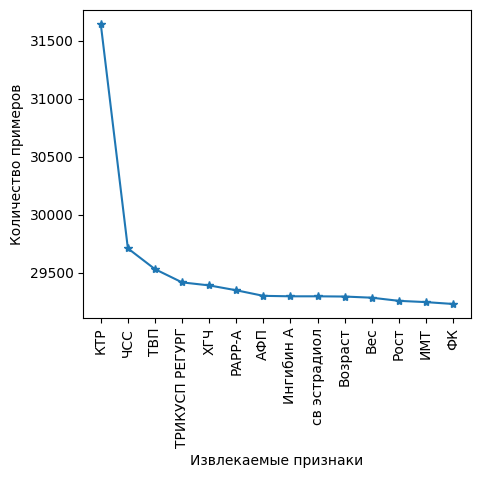
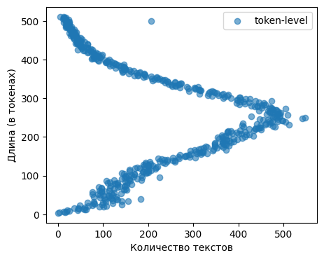
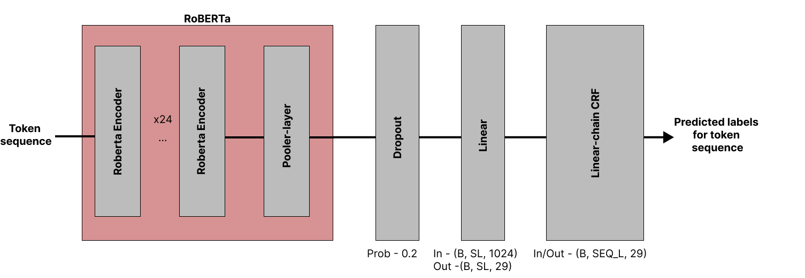
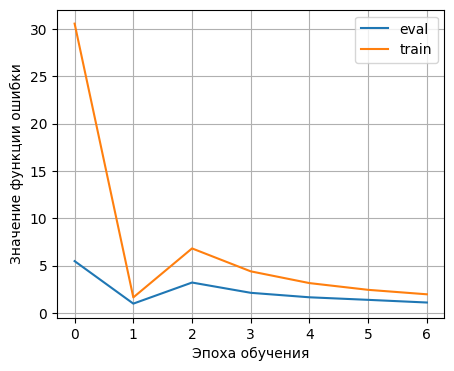
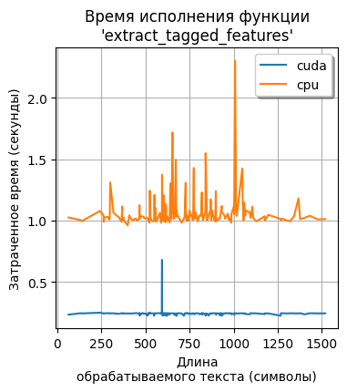

# Отчёт "Лабораторная №4"
**Работу выполнили студенты 1 курса магистратуры (группа M4130) ИТМО:** Меньщиков Михаил, Лютиков Богдан, Рогачёв Кирилл

**Дисциплина:** Технологии программирования и обучения глубоких сетей

# **Содержание:**

[1 Постановка задания (ответственный: Кирилл, Богдан)](#1-постановка-задания-ответственный-кирилл-богдан)

[2 Решение (ответственный: Михаил)](#2-решение-ответственный-михаил)

[2.1 Описание](#21-описание)

[2.2 Структура кода](#22-структура-кода)

[2.3 Выводы](#23-выводы)

[3 Заключение (ответственный: Кирилл, Богдан)](#3-заключение-ответственный-кирилл-богдан)

[Список использованных источников](#список-использованных-источников)

[Приложение А (Ответственный: Михаил)](#приложение-а-ответственный-михаил)

[Приложение Б (Ответственный: Михаил)](#приложение-б-ответственный-михаил)

[Приложение В (Ответственный: Богдан)](#приложение-в-ответственный-богдан)

[Список использованных источников](#список-использованных-источников-1)

[Приложение Г (Ответственный: Богдан)](#приложение-г-ответственный-богдан)

[Список использованных источников](#список-использованных-источников-2)

##

## **1 Постановка задания** (ответственный: Кирилл, Богдан)

**Цель:** Решение задачи NER на выбранном датасете в соответствии с выбранным вариантом.

**Задание:**

1. Подготовить датасет.
2. Реализовать нейронную сеть, указанную в варианте для задачи NER.
3. Оцените качество модели на тесте.
4. Сделать отчёт и выложить исходный код решения на GitHub.

**Выбранный вариант:** 9 (RoBERTa+CRF).

## **2 Решение** (ответственный: Михаил)

## **2.1 Описание**

В качестве тренировочного был использован датасет, полученный в рамках реализации гранта "Главы Республики Карелия 2023" по разработке скрининговой системы для расчета индивидуального риска хромосомных аномалий у плода беременной пациентки на основе цифровых медицинских текстов. Датасет представляет из себя список медицинских текстов с описанием здоровья пациентов, для которых выполнена разметка 14 извлекаемых признаков, указанных в Приложении А. Разметка представляет из себя указание позиции фрагмента текста (в символах), где идёт описание конкретного признака, а также локальной позиции (внутри размеченного фрагмента) его извлекаемого числового значения. На Рисунке 1 представлено количество примеров, приходящихся на каждый признак. На Рисунке 2 представлено распределение длин медицинских текстов в датасете.

**Рисунок 1.** Количество примеров, приходящихся на каждый признак в размеченном датасете

**Рисунок 2.** Распределение длин медицинских текстов в размеченном датасете

В качестве архитектуры NER-модели была использована комбинация из бэкбона в виде предобученной RoBERTa-сети [1] и CRF-слоя [2]: визуализация архитектуры представлена на Рисунке 3. Теоретическая информация по RoBERTa-архитектуре представлена в Приложении В. Теоретическая информация по CRF-слою представлена в Приложении Г.

**Рисунок 3.** Высокоуровневая архитектура используемой NER-модели

В качестве конкретной реализации RoBERTa-модели использовалась RuBioRoBERTa (от SberDevices) [3]: RuRoBERTa-модель [4], дообученная на медицинских текстах. В качества формата истинных меток для обучения и вынесения предсказаний использовалась CoNLL BIO [5].

Для выполнения дообучения полученной архитектуры был заморожен весь бэкбон кроме последних трёх encoder-блоков + pooler-слоя. Были использованы следующие значения гиперпарметров для обучения модели: learning\_rate – 2e-5; epochs – 8; batch\_size – 32; optimizer – Adam; loss\_function – NLLLoss. Исходная выборка была разбита на train/test/eval-части в соотношении 80/10/10. Для сокращения временных затрат была арендована видеокарта RTX3090 [6]. В среднем каждая эпоха обучения + валидация заняла ~2 часа. На Рисунке 4 представлено изменение функции ошибки на train- и eval-выборках в процессе обучения модели.

**Рисунок 4.** Изменение функций ошибки в процессе обучения NER-модели

В Приложении Б представлено полученное качество извлечения заданного набора признаков. Общее качество модели имеет следующие значения по метрике "seqeval" [7]: overall\_precision – 0.979, overall\_recall – 0.971, overall\_f1 – 0.97, overall\_accuracy – 0.997.

Так как использованная архитектура NER-модели имеет ограничение по размеру входной последовательности (512 токенов + 2 специальных), выполняется разбиение длинных текстов для последовательной подачи их в нейронную сеть и получения независимых предсказаний. Зависимость между временем извлечения (в секундах) и размером входной последовательности (в символах) представлена на Рисунке 5.

**Рисунок 5.** Зависимость времени работы функции извлечения признаков от длины текста

Минимальное время (в секундах) обработки текста функцией "extract\_tagged\_features" составило 0.961 (CPU) и 0.224 (GPU), среднее – 1.067 (CPU) и 0.244 (GPU), максимальное – 2.303 (CPU) и  0.680 (GPU).  Время загрузки теговой модели на CPU и GPU составило 2.874 и 3.254 секунд. Тестирование проводилось на машине со следующими характеристиками:

- ОС – Linux Mint 21.2 Victoria 64-bit;
- CPU – Intel® Core™ i5-9400F CPU @ 2.90GHz × 6;
- RAM – 23.4 GB;
- GPU – NVIDIA GeForce GTX 1050 Ti/PCIe/SSE2;
- HDD - WD Blue 1 TB.

## **2.2 Структура кода**

- /debug
  - example.ipynb – пример построения конвейера на основании функционала из "t\_extraction\_utils.py" и "general\_utils.py" для извлечения признаков.
  - example\_tagged\_input.csv – выборка для проверки качества извлечения признаков.
- /metrics – директория с метриками и лог-файлами, полученных в процессе обучения используемых моделей.
- crf.py – реализация LongChain CRF-слоя
- general\_utils.py – программные функции и структуры данных для построения конвейера по извлечению теговых признаков.
- t\_extraction\_utils.py – функция перевода результатов предсказания NER-модели в человекочитаемый формат.
- tagged\_test.py – цикл тестирования модели извлечения признаков
- tagged\_train.py – цикл обучения модели извлечения признаков.

## **2.3 Выводы**

Таким образом, была обучена NER-модель для задачи извлечения показателей здоровья пациентки из цифровых медицинских карт. Для NER-модели значение метрики F1 (micro) равно 0.97 при объёме тестовой выборки ~11 тыс. текстов. Для сравнения была обучена модель с RobertaForTokenClassification-архитекутрой [8]: в качестве головы для предсказания метки токена используется обычный линейный слой. По сравнению с RobertaCRF-архитектурой значительных падений в качестве не было: различие на сотые доли. Также одна эпоха обучения+валидации NER-модели с линейный заняла ~1 час (для NER-модели с CRF-слоем ~2 часа).

**Недостатки.** (1) В тренировочном множестве отсутствует примеры текстов, в которых присутствует только извлекаемый признак: без дополнительного контекста-шума.(2) В качестве алгоритма разбиения длинных текстов используется разбиение на подпоследовательности максимальной длины (по 514 токенов) + хвост.

**Возможные улучшения.** (1)Расширить тренировочное множество для покрытия большего количества возможных описаний состояния здоровья пациента и увеличения качества распознавания извлекаемых текстовых фрагментов. (2) Разработать алгоритм разбиения длинных текстов без потери частей контекста в полученных фрагментах.

## **3 Заключение** (ответственный: Кирилл, Богдан)

В результате выполнения данной лабораторной был получен практический опыт дообучения нейросетевых моделей для задачи NER. Была решена задача извлечения числовых характеристик состояния здоровья пациенток из цифровых медицинских карт для дальнейшей оценки риска возникновения хромосомных аномалий у плода. В качестве бэкбона была использована BioRuRoBERTa-модель с обучаемым CRF-слоем.

## **Список использованных источников**

1. RoBERTa: A Robustly Optimized BERT Pretraining Approach [Электронный ресурс] // arxiv.org. – 2023. – URL: [https://arxiv.org/abs/1907.11692](https://arxiv.org/abs/1907.11692) (дата обращения: 28.12.23)
2. An Introduction to Conditional Random Fields [Электронный ресурс] // arxiv.org. – 2023. – URL: [https://arxiv.org/abs/1011.4088](https://arxiv.org/abs/1011.4088) (дата обращения: 28.12.23)
3. RuBioRoBERTa [Электронный ресурс] // huggingface.co. – 2023. – URL: [https://huggingface.co/alexyalunin/RuBioRoBERTa](https://huggingface.co/alexyalunin/RuBioRoBERTa) (дата обращения: 28.12.23)
4. RuRoBERTa [Электронный ресурс] // huggingface.co. – 2023. – URL: [https://huggingface.co/ai-forever/ruRoberta-large](https://huggingface.co/ai-forever/ruRoberta-large) (дата обращения: 28.12.23)
5. Inside–outside–beginning (tagging) [Электронный ресурс] // en.wikipedia.org. – 2023. – URL: [https://en.wikipedia.org/wiki/Inside%E2%80%93outside%E2%80%93beginning\_(tagging)](https://en.wikipedia.org/wiki/Inside%E2%80%93outside%E2%80%93beginning_(tagging)) (дата обращения: 28.12.23)
6. Immers Cloud [Электронный ресурс] // immers.cloud. – 2023. – URL: [https://immers.cloud/](https://immers.cloud/) (дата обращения: 28.12.23)
7. Metric: seqeval [Электронный ресурс] // huggingface.co. – 2023. – URL: [https://huggingface.co/spaces/evaluate-metric/seqeval](https://huggingface.co/spaces/evaluate-metric/seqeval) (дата обращения: 28.12.23)
8. RobertaForTokenClassification [Электронный ресурс] // huggingface.co. – 2023. – URL: [https://huggingface.co/docs/transformers/v4.36.1/en/model\_doc/roberta#transformers.RobertaForTokenClassification](https://huggingface.co/docs/transformers/v4.36.1/en/model_doc/roberta#transformers.RobertaForTokenClassification) (дата обращения: 01.01.24)

## **Приложение А** (Ответственный: Михаил)

**Извлекаемы признаки**

С помощью реализованной NER-модели выполняется извлечение признаков, представленных в Таблице 1.

Таблица 1 — Список извлекаемых "теговых" признаков

| № | **Признак** | **Единицы измерения** | **Варианты написания** |
| --- | --- | --- | --- |
| 1 | Копчико-теменной размер плода | мм | В матке один живой плод, копчико-теменной размер 44 мм |
| 2 | ЧСС | уд/мин. | С/биение у плода 100 ударов в минуту |
| 3 | Толщина воротникового пространства | мм | По УЗИ толщина воротникового пространства 2 мм |
| 4 | Кровоток через трикуспидальный клапан в правых отделах сердца | см/с | Экспертное заключение: трикуспидальная регургитация 2.5 см/с |
| 5 | Свободная бета-субъединица ХГЧ | мМЕ/л, МоМ | Сдана кровь на сыв маркеры, результат β – ХГЧ 30000 мМЕ/мл |
| 6 | Ассоциированный с беременностью протеин-А плазмы | МЕ/л, МоМ | белок А связанный с беременностью 50 МЕ/л |
| 7 | Альфа-фетопротеин | МЕ/мл | Одномоментно определен уровень альфа-ФП 20000 МЕ/мл |
| 8 | Ингибин А | Пг/мл | Ингибин А 200 пг/мл по результатам 2-го тестирования |
| 9 | Неконъюгированный эстрадиол | Нг/мл | У пациентки в крови уровень свободный эстрадиол 15000 нг/мл |
| 10 | Материнский возраст | лет | Пациентке 30 лет - повторнобеременная, первородящая |
| 11 | Вес матери | кг | Вес пациентки при постановке на учет 70 кг |
| 12 | Рост матери | см | Телосложение астеническое, рост пациентки 170 см |
| 13 | ИМТ | кг/м2 | индекс массы тела 25 кг/м2, не менялся полседние два года |
| 14 | Уровень фолиевой кислоты | нмоль/л | клинико-лабораторное обследование: Витамин В9 20 нмоль/л |

## **Приложение Б** (Ответственный: Михаил)

**Качество NER-модели**

Качество извлечение признаков, указанных в Приложении А, с помощью NER-модели представлено в Таблице 1. Тестовая выборка состояла из 11077 текстовых записей с описанием состояния здоровья пациентов.

Таблица 1 — Качество извлечения "теговых" признаков

| № | **Признак** | **Precision** | **Recall** | **F1 (micro)** |
| --- | --- | --- | --- | --- |
| 1 | Копчико-теменной размер плода | 0.991 | 0.978 | 0.984 |
| 2 | ЧСС | 0.891 | 0.855 | 0.873 |
| 3 | Толщина воротникового пространства | 0.985 | 0.986 | 0.985 |
| 4 | Кровоток через трикуспидальный клапан в правых отделах сердца | 0.992 | 0.980 | 0.986 |
| 5 | Свободная бета-субъединица ХГЧ | 0.984 | 0.975 | 0.979 |
| 6 | Ассоциированный с беременностью протеин-А плазмы | 0.979 | 0.987 | 0.983 |
| 7 | Альфа-фетопротеин | 0.968 | 0.986 | 0.977 |
| 8 | Ингибин А | 0.968 | 0.986 | 0.977 |
| 9 | Неконъюгированный эстрадиол | 0.986 | 0.990 | 0.988 |
| 10 | Материнский возраст | 0.994 | 0.988 | 0.991 |
| 11 | Вес матери | 0.982 | 0.934 | 0.958 |
| 12 | Рост матери | 0.987 | 0.966 | 0.976 |
| 13 | ИМТ | 0.976 | 0.955 | 0.966 |
| 14 | Уровень фолиевой кислоты | 0.985 | 0.987 | 0.986 |
| **Среднее значение:** | **0.976** | **0.968** | **0.972** |

## **Приложение В** (Ответственный: Богдан)

**Описание RoBERTa-архитектуры**

Модель основанная на BERT [1]. В отличие от своего предшественника RoBERTa [2] (Robustly optimized BERT approach) обучалась только генерации пропущенного токена, без предсказания следующего предложения. Также при обучении сменили некоторые параметры. Так RoBERTa училась на бОльшем датасете с увеличенным размером батча и словаря, а также использованием динамического маскирования.

В RoBERTa меняли лишь внешние подходы и параметры обучения, но не трогали архитектуру модели.

Архитектура BERT (Bidirectional Encoder Representations from Transformers) взяла в себя только Encoder части из Transformer [3]. Это стек из 12 энкодеров в базовой и 24 в большой версии BERT [4].

|  |  |
| --- | --- |

Каждый энкодер такой же как в оригинальной статье про трансформер. Состоит из многоголового внимания, полносвязного слоя, нормализаций и скип-коннекшенов. В отличии от оригинального трансформера в BERT(base) количество энкодеров 12, размерность скрытого состояния 768, голов самовнимания у каждого экодера 12 и в общей сумме 110 млн. параметров.

## **Список использованных источников**

1. BERT: Pre-training of Deep Bidirectional Transformers for Language Understanding - [Электронный ресурс] // arxiv.org. – 2023. – URL: [https://arxiv.org/abs/1810.04805](https://arxiv.org/abs/1810.04805) (дата обращения: 28.12.23)
2. RoBERTa: A Robustly Optimized BERT Pretraining Approach // arxiv.org. – 2023. – URL: [https://arxiv.org/abs/1907.11692](https://arxiv.org/abs/1907.11692) (дата обращения: 28.12.23)
3. Attention Is All You Need - [Электронный ресурс] // arxiv.org. – 2023. – URL: [https://arxiv.org/abs/1706.03762](https://arxiv.org/abs/1706.03762) (дата обращения: 28.12.23)
4. The Illustrated BERT, ELMo, and co. (How NLP Cracked Transfer Learning) - [Электронный ресурс] // jalammar.github.io. – 2023. – URL: [https://jalammar.github.io/illustrated-bert/](https://jalammar.github.io/illustrated-bert/) (дата обращения: 28.12.23

## **Приложение Г** (Ответственный: Богдан)

**Описание CRF-слоя**

Conditional Random Field представляет из себя метод статистического моделирования. CRF может учитывать контекст. Для этого предсказания моделируются в виде графовой модели, которая отражает наличие зависимостей между предсказаниями. В обработке естественного языка популярны CRF с "линейной цепью", в которых каждое предсказание зависит только от своих ближайших соседей. [1]

CRF - это тип дискриминативной модели, которая строит вероятностное распределение

,

где x обозначает входную последовательность , а s - последовательность состояний .

Ключевая идея CRF заключается в определении вектора признаков который отображает всю входную последовательность x в паре со всей последовательностью состояний s на некоторый d-мерный вектор признаков [2].

Вероятностная модель строится следующим образом:

,

где - множество всех возможных последовательностей меток токенов длины m.

Определение таково

Вектора признаков могут представлять из себя любые функции, но в случае с NER и получаемыми от BERT ембеддингами обычно предлагают такой вариант [3].

В данном случае Emission получается с последнего скрытого слоя BERT и оценивает, насколько хорошо текущий элемент соответствует каждой из возможных меток. Это помогает модели учесть информацию о самом элементе при присвоении ему метки.

Transition представляет из себя квадратную матрицу обучаемых параметров (размер = количеству меток) и учитывает вероятности перехода от одной метки к другой. Например, может оценивать вероятности перехода от метки "B" (начало имени) к метке "I" (продолжение имени) или к метке "O" (не именованная сущность). Потенциал перехода помогает модели моделировать последовательностные зависимости между различными метками.

Задача декодирования в CRFs состоит в следующем: для заданной входной последовательности , мы хотели бы найти наиболее вероятную последовательность состояний, лежащую в основе модели, то есть

Упростив это выражение получим

Эта проблема имеет четкий интуитивный смысл. Каждый переход из состояния в состояние имеет соответствующую оценку

Эта оценка может быть положительной или отрицательной. Эта оценка будет относительно высокой, если переход из состояния в состояние правдоподобен, и относительно низкой, если этот переход неправдоподобен. Задача декодирования состоит в том, чтобы найти такую последовательность состояний, при которой сумма оценок переходов максимальна. Авторы предлагают решить эту проблему, используя вариант алгоритма Витерби.

Инициализация для :

где - особое "начальное" состояние.

Для j = 2 ... m, s = 1 ... k:

Таким образом, мы имеем

И так мы можем восстановить путь приводящий к максимальной оценке.

Подбор параметров CRF

где примеры из тренировочного датасета.

## **Список использованных источников**

1. An Introduction to Conditional Random Fields - [Электронный ресурс] // arxiv.org. – 2023. – URL: [https://arxiv.org/abs/1011.4088](https://arxiv.org/abs/1011.4088) (дата обращения: 28.12.23)
2. Michael Collins: Log-Linear Models, MEMMs, and CRFs – URL: [https://www.cs.columbia.edu/~mcollins/crf.pdf](https://www.cs.columbia.edu/~mcollins/crf.pdf) (дата обращения: 28.12.23)
3. ADVANCED: MAKING DYNAMIC DECISIONS AND THE BI-LSTM CRF - [Электронный ресурс] // pytorch.org – 2023.URL: [https://pytorch.org/tutorials/beginner/nlp/advanced\_tutorial.html](https://pytorch.org/tutorials/beginner/nlp/advanced_tutorial.html)(дата обращения: 28.12.23)
